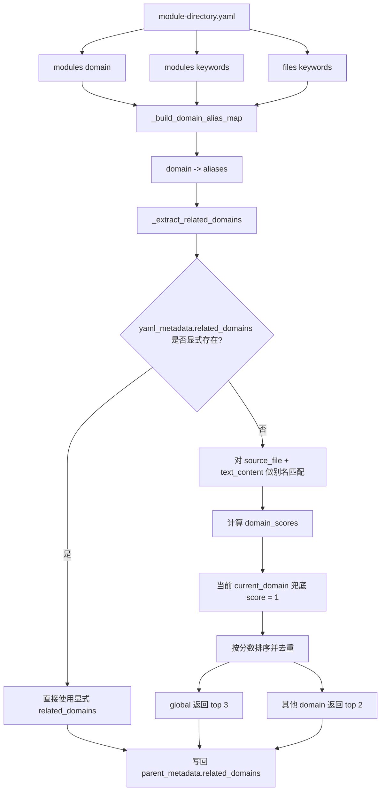
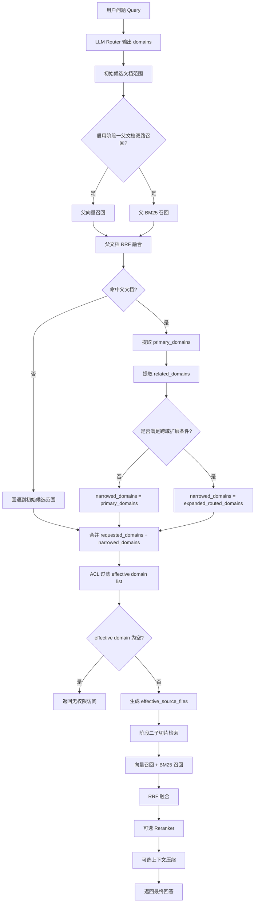
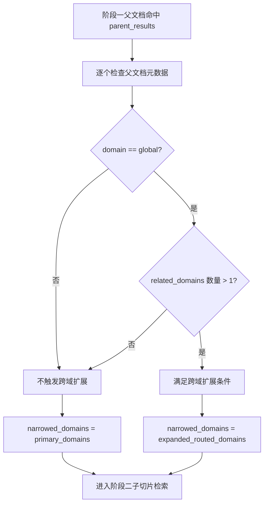

## domain / keywords / related_domains 如何映射到域推断

这张图把 `module-directory.yaml` 里的配置、别名展开、相关域推断串成一条链路。现在系统不再依赖手写的 `DOMAIN_ALIAS_MAP`，而是从目录配置里的 `domain`、`keywords` 和 `files[].keywords` 生成可匹配别名，再用于 `related_domains` 推断。



关键关系可以直接理解成三层：

- `domain` 是标准域名，是最终归属的主键。
- `keywords` 和 `files[].keywords` 是这个域的别名池，会被展开成可匹配字符串。
- `related_domains` 是推断结果或显式配置，最终写入父文档元数据，供阶段一父文档召回和跨域扩展使用。

## 阶段一 / 阶段二检索流程

下面这张图概括了当前后端的两阶段处理方式：先用 LLM 给出的 `domains` 作为初始检索范围，再经过阶段一父文档召回，生成 `routed_domains`、`expanded_routed_domains` 和最终 `narrowed_domains`，最后在 effective domain list 上做 ACL 过滤并进入阶段二子切片检索。



图里的几个关键字段对应后端日志中的概念如下：

- `routed_domains`：阶段一命中的主域。
- `expanded_routed_domains`：主域加上 `related_domains` 后的扩展域。
- `narrowed_domains`：阶段二真正收敛使用的域，必要时会放宽到扩展域。
- `effective domain list`：把 LLM 输入域和阶段一结果合并后的最终生效域，ACL 只在这里做过滤。

## 是否满足跨域扩展条件

这张图专门说明阶段一父文档命中后，什么时候会把 `primary_domains` 放宽成 `expanded_routed_domains`。



核心规则只有一条：命中的父文档必须是 `global` 域，并且它的 `related_domains` 至少包含两个域，才会触发跨域扩展。

## query_type 如何影响动态路由

`query_type` 先被标准化，再映射成 `retrieval_plan`，最后决定执行模式、召回策略和召回参数。若传入值不在配置中，会回退到配置里的 `default_query_type`，当前默认是 `semantic`。

```mermaid
flowchart TD
    A[用户传入 query_type] --> B[normalize_query_type]
    B --> C{是否在 routing config 中?}
    C -->|否| D[回退到 default_query_type]
    C -->|是| E[使用标准 query_type]
    D --> F[get_retrieval_strategy_plan]
    E --> F

    F --> G[读取 query_types 中的 query_type]
    G --> H[生成 retrieval_plan]
    H --> I[execution_mode]
    H --> J[strategy]
    H --> K[vector_k / bm25_k]
    H --> L[vector_weight / bm25_weight]
    H --> M[fusion_top_k]

    I --> N{execution_mode 是什么?}
    N -->|hybrid| O[向量召回 + BM25 召回 + RRF 融合]
    N -->|faq_lookup| P[FAQ 专用召回]
    N -->|sql_query| Q[结构化查询召回]

    O --> R[可选 Reranker]
    P --> R
    Q --> R
    R --> S[返回最终上下文]
```

你可以把它理解成两层控制：`query_type` 负责选路由模板，`retrieval_plan` 负责把这个模板展开成具体的检索行为和参数。

---