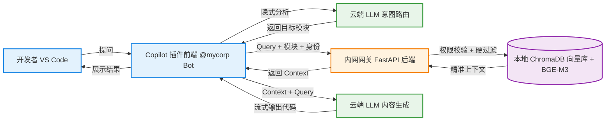
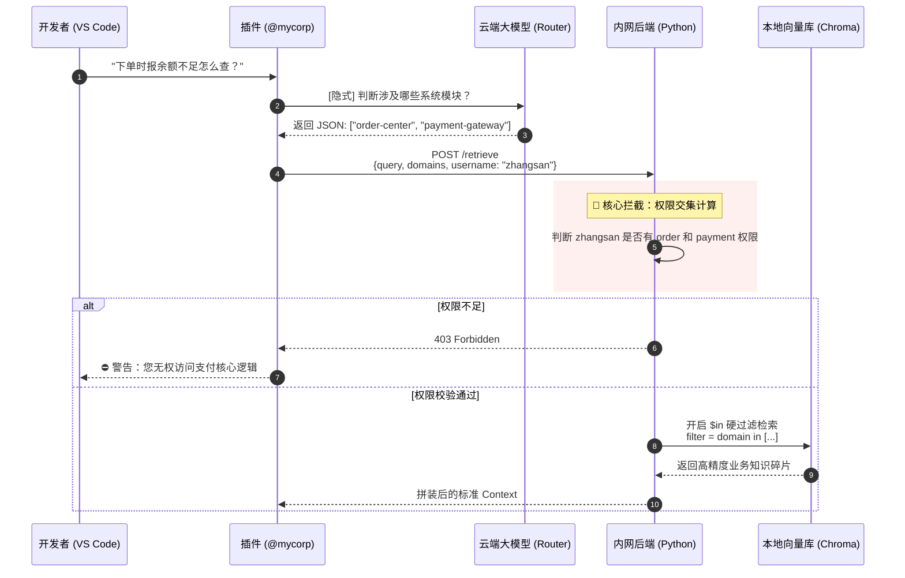

# 企业级私有 RAG 演讲：Agentic RAG、零信任与 ROI
**副标题：基于 GitHub Copilot 与 Agentic RAG 的零信任知识库实践**

---

## 📄 Slide 1: 企业级私有 RAG 封面与副标题
**【PPT 画面内容】**
*   **大标题：** 让 Copilot 真正懂我们的业务：企业级私有 RAG 最佳实践
*   **副标题：** 从“大杂烩检索”到“意图路由 + 零信任隔离”
*   **演讲人：** [你的名字/职位]
*   **视觉元素：** 现代简约风格，以红色为主色调，搭配 GitHub Copilot 的 Logo 和一个代表公司内部服务的建筑/代码库图标。

    


---

## 📄 Slide 2: 传统 RAG 的痛点：大杂烩、跨模块幻觉与越权风险
**【PPT 画面内容】**
*   **左侧视觉：** 一个画着大杂烩的图标，或者一堆乱七八糟混在一起的文档和代码片段。
*   **右侧视觉：** Copilot 给出了一段把“订单状态”和“支付状态”混在一起的错误代码（带有 ❌ 符号）。
*   **三个核心痛点（Bullet Points）：**
    1.  **大杂烩文档（Garbage In）：** 架构说明、API 字典、操作步骤混在一起，切片后语义支离破碎。
    2.  **跨模块幻觉（Cross-module Hallucination）：** 向量检索无法区分相似概念，AI 容易精神分裂。
    3.  **数据越权风险（Security Risk）：** 人员可能随便获取未授权内容。


---

## 📄 Slide 3: Agentic RAG 全景架构：路由、隔离与云端生成
**【PPT 画面内容】**
*   *(请将以下 Mermaid 代码渲染为架构图放入 PPT)*

*   **核心亮点标注：** 意图路由、物理隔离、白嫖云端算力。


---

## 📄 Slide 4: 权限校验与精准检索时序图
**【PPT 画面内容】**
*   *(请将以下 Mermaid 代码渲染为时序图放入 PPT，重点突出权限校验和检索的过程)*



---

## 📄 Slide 5: Diátaxis 规范与 YAML 元数据注入
**【PPT 画面内容】**
*   **左侧：** Diátaxis 的 2x2 矩阵图（Tutorials, How-to, Reference, Explanation）。
*   **右侧：** 一个带有 YAML Metadata 的 Markdown 代码截图。
    ```yaml
    ---
    domain: order-center
    type: reference
    version: v1.0
        acl:
            allow:
                - zhangsan
                - lisi
    ---
    # 订单状态机枚举...
    ```
*   **底部标注：** 强制注入 YAML 标签 -> 结构化切分 -> 元数据死死绑定。


---

## 📄 Slide 6: BGE-M3 与 ChromaDB 本地向量引擎
**【PPT 画面内容】**
*   **视觉元素：** BAAI/bge-m3 和 ChromaDB 的 Logo。
*   **三个标签：** 
    1. 🛡️ 100% 断网可用（数据不流出内网）
    2. 🚀 多语言极强（中英夹杂 + 代码特化）
    3. 💻 轻量级部署（普通 CPU 即可极速运行）


---

## 📄 Slide 7: 开发者体验与 ROI：准确率、成本与安全
**【PPT 画面内容】**
*   **左侧：** 模拟 VS Code 侧边栏对话流的截图。
    *   *用户输入：`@mycorp 前端调登录接口报错 401 怎么办？`*
    *   *系统提示：`🧠 分析业务模块...` -> `🎯 锁定: user-center` -> `✨ 生成回答...`*
*   **右侧价值总结：**
    1.  **极高准确率：** Diátaxis + 意图路由，告别 AI 瞎编。
    2.  **极低成本：** 白嫖 Copilot 云端算力，后端仅需低配机器跑 Chroma。
    3.  **绝对安全：** 行级 RBAC 交集控制，硬代码物理隔离。


---