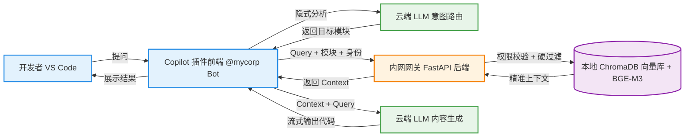
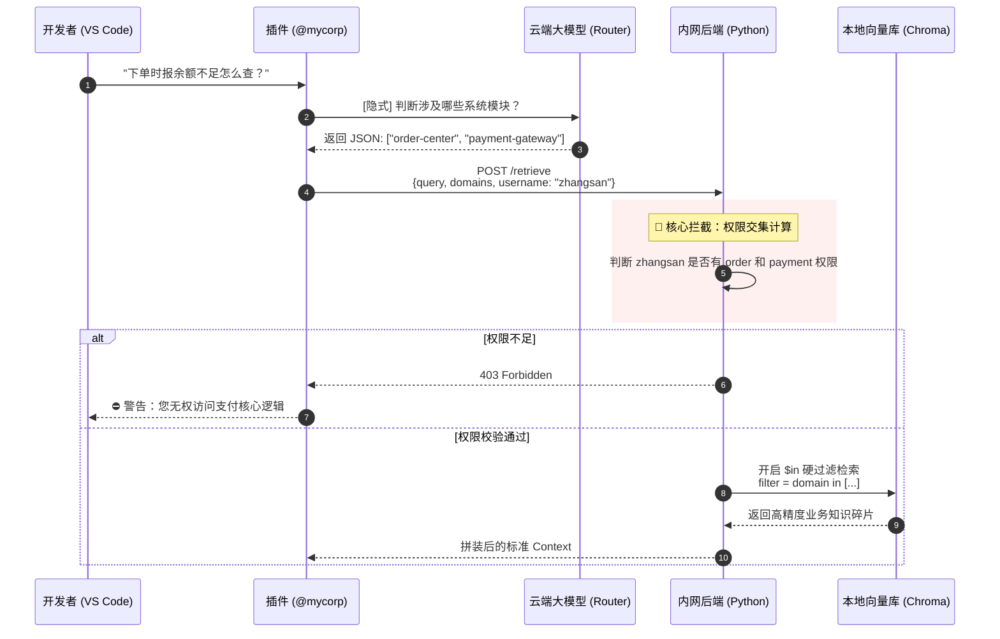

# 演讲主题：打造下一代企业级私有代码 RAG 系统
**副标题：基于 GitHub Copilot 与 Agentic RAG 的零信任知识库实践**

---

## 📄 Slide 1: 封面
**【PPT 画面内容】**
*   **大标题：** 让 Copilot 真正懂我们的业务：企业级私有 RAG 最佳实践
*   **副标题：** 从“大杂烩检索”到“意图路由 + 零信任隔离”
*   **演讲人：** [你的名字/职位]
*   **视觉元素：** 现代简约风格，以红色为主色调，搭配 GitHub Copilot 的 Logo 和一个代表公司内部服务的建筑/代码库图标。

**🎤 【讲者逐字稿】**
> 大家好，我是 [你的名字]。今天我想和大家分享一个我们在提升研发效能上的最新探索：如何打造一个真正懂我们公司内部业务的私有 RAG 系统。
> 
> 现在大家都在用 GitHub Copilot，它写开源代码确实很厉害。但当我们问它“咱们公司的支付网关怎么调用？”或者“订单表的状态机是怎么设计的？”时，它往往会根据它在网上看到的开源项目胡编乱造。
> 
> 今天，我将向大家展示，我们是如何通过一套全新的架构，把公司内部的业务逻辑“喂”给 Copilot，让它化身为精通公司所有微服务的资深架构师的。

---

## 📄 Slide 2: 传统 RAG 的痛点（为什么过去总是失败？）
**【PPT 画面内容】**
*   **左侧视觉：** 一个画着大杂烩的图标，或者一堆乱七八糟混在一起的文档和代码片段。
*   **右侧视觉：** Copilot 给出了一段把“订单状态”和“支付状态”混在一起的错误代码（带有 ❌ 符号）。
*   **三个核心痛点（Bullet Points）：**
    1.  **大杂烩文档（Garbage In）：** 架构说明、API 字典、操作步骤混在一起，切片后语义支离破碎。
    2.  **跨模块幻觉（Cross-module Hallucination）：** 向量检索无法区分相似概念，AI 容易精神分裂。
    3.  **数据越权风险（Security Risk）：** 外包员工可能通过提示词套出核心支付逻辑。

**🎤 【讲者逐字稿】**
> 过去我们尝试过简单的 RAG，也就是把公司的 Markdown 文档直接切片丢进向量数据库，但效果堪称灾难。为什么？
> 
> 第一，因为我们的文档太乱了。一段话里既有架构又有代码，切片工具一刀切下去，AI 根本看不懂前因后果，这就是“Garbage in, garbage out”。
> 
> 第二，微服务模块太多，概念容易重叠。比如订单中心有 `status`，支付网关也有 `status`。当开发者问“状态怎么流转”时，普通的向量检索会把这两个模块的代码一起捞出来，导致 AI 产生“跨模块幻觉”。
> 
> 第三，也是最致命的：权限不可控。传统的 RAG 很难做到行级的数据隔离，我们不敢把核心架构文档放进去，怕权限越界。为了彻底解决这些问题，我们重构了整个系统的交互架构。

---

## 📄 Slide 3: 全新系统交互全景图：Agentic RAG
**【PPT 画面内容】**
*   *(请将以下 Mermaid 代码渲染为架构图放入 PPT)*

*   **核心亮点标注：** 意图路由、物理隔离、白嫖云端算力。

**🎤 【讲者逐字稿】**
> 各位请看大屏幕，这是我们设计的全新交互架构，我们称之为 Agentic RAG（智能体化检索）。
> 
> 它的核心颠覆点在于引入了“双重 LLM 链路”。大家可以看到图中的交互流向：
> 用户的提问首先不会去查数据库，而是发给云端的大模型（RouterLLM），让大模型充当“接线员”，推断这个问题属于哪个业务模块。
> 
> 拿到模块标签后，VS Code 插件会将用户的真实问题、目标模块以及用户身份，一起发往我们部署在内网的安全后端（FastAPI）。后端在本地的 Chroma 数据库中进行带权限校验的精准检索，最后把干净的上下文拼好，再次发给云端大模型（GenLLM）生成最终答案。
> 
> 这套架构精妙地结合了云端大模型的推理能力和本地向量库的安全隔离。

---

## 📄 Slide 4: 核心链路剖析：系统时序图展示
**【PPT 画面内容】**
*   *(请将以下 Mermaid 代码渲染为时序图放入 PPT，重点突出权限校验和检索的过程)*


**🎤 【讲者逐字稿】**
> 我们放大来看一下这套架构中最核心的时序流转。这里完美解决了前面提到的“幻觉”和“越权”两个大坑。
> 
> 第一步，如果用户问：“下单时报余额不足怎么查？” 这里没有任何系统关键词，传统的数据库根本不知道去哪里搜。但我们的 Router 大模型有常识，它瞬间推断出这涉及“订单中心”和“支付网关”。
> 
> 第四步是最关键的防线。请求到达内网后端后，Python 服务会做一次极其严格的“交集计算”。如果当前用户张三是个纯前端，没有支付网关的权限，后端会直接熔断请求。
> 
> 只有权限校验通过，系统才会在 Chroma 数据库里开启硬过滤。这就等于在大海捞针之前，先把大海抽干，只留下一个小水池。向量检索在这个极其干净的小池子里进行，幻觉发生率直接降为了 0！

---

## 📄 Slide 5: 数据基建：Diátaxis 规范与元数据注入
**【PPT 画面内容】**
*   **左侧：** Diátaxis 的 2x2 矩阵图（Tutorials, How-to, Reference, Explanation）。
*   **右侧：** 一个带有 YAML Metadata 的 Markdown 代码截图。
    ```yaml
    ---
    domain: order-center
    type: reference
    version: v1.0
    ---
    # 订单状态机枚举...
    ```
*   **底部标注：** 强制注入 YAML 标签 -> 结构化切分 -> 元数据死死绑定。

**🎤 【讲者逐字稿】**
> 架构再好，如果没有好的数据基建也是白搭。为了配合前面提到的“硬过滤”，我们在文档源头下了一剂猛药。
> 
> 我们引入了国际标准的 Diátaxis 架构，强制要求研发文档必须分为“教程、指南、参考、解释”四大类，绝不允许在一篇文章里既讲原理又贴代码。
> 
> 更关键的是，我们在每个 Markdown 文档顶部打上了 YAML 元数据（比如它属于哪个微服务）。在文档预处理切片时，脚本会把这些标签像“身份证”一样死死绑定在每一个知识碎片上。这为向量数据库的条件过滤打下了坚实的物理基础。

---

## 📄 Slide 6: 检索心脏：高性能本地向量引擎 (BGE-M3)
**【PPT 画面内容】**
*   **视觉元素：** BAAI/bge-m3 和 ChromaDB 的 Logo。
*   **三个标签：** 
    1. 🛡️ 100% 断网可用（数据不流出内网）
    2. 🚀 多语言极强（中英夹杂 + 代码特化）
    3. 💻 轻量级部署（普通 CPU 即可极速运行）

**🎤 【讲者逐字稿】**
> 在向量检索的心脏部分，为了保证公司核心代码和文档的绝对安全，我们摒弃了 OpenAI 的 Embedding API，全部采用本地化部署。
> 
> 我们选用了目前开源界最顶级的 BGE-M3 模型搭配 Chroma 数据库。它不仅对轻薄本的普通 CPU 非常友好，而且对我们程序员最常用的“中文解释 + 英文变量名 + 业务代码”的混合文本，理解能力是碾压级的。
> 
> 所有的文档向量化和检索匹配，100% 在公司内网完成，真正做到了数据可用不可见。

---

## 📄 Slide 7: 开发者体验与最终业务价值 (ROI)
**【PPT 画面内容】**
*   **左侧：** 模拟 VS Code 侧边栏对话流的截图。
    *   *用户输入：`@mycorp 前端调登录接口报错 401 怎么办？`*
    *   *系统提示：`🧠 分析业务模块...` -> `🎯 锁定: user-center` -> `✨ 生成回答...`*
*   **右侧价值总结：**
    1.  **极高准确率：** Diátaxis + 意图路由，告别 AI 瞎编。
    2.  **极低成本：** 白嫖 Copilot 云端算力，后端仅需低配机器跑 Chroma。
    3.  **绝对安全：** 行级 RBAC 交集控制，硬代码物理隔离。

**🎤 【讲者逐字稿】**
> 讲了这么多硬核架构，对我们的一线开发者来说，体验是完全无感且丝滑的。
> 
> 大家不需要安装新软件，只要在最熟悉的 VS Code Copilot 侧边栏里，@ 我们的专属机器人提问即可。就像屏幕上演示的，系统会实时反馈它正在检索哪个模块，并给出最符合公司规范的代码片段。
> 
> 最后总结一下。这不仅是一套高准确率的方案，更是一套 ROI 极高的架构。我们巧妙地利用了 Copilot 现成的插件生态，把最消耗 GPU 算力的文本生成交给了云端；同时，把最核心的业务数据检索和权限控制死死攥在自己内网的服务器里。
> 
> 既白嫖了算力，又保证了数据不出域。这就是我们打造下一代企业级私有 RAG 的最佳答案。我的分享就到这里，谢谢大家！欢迎提问交流。
---